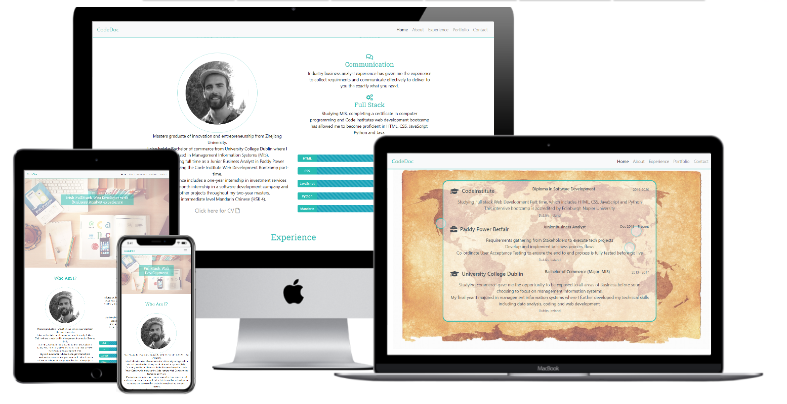
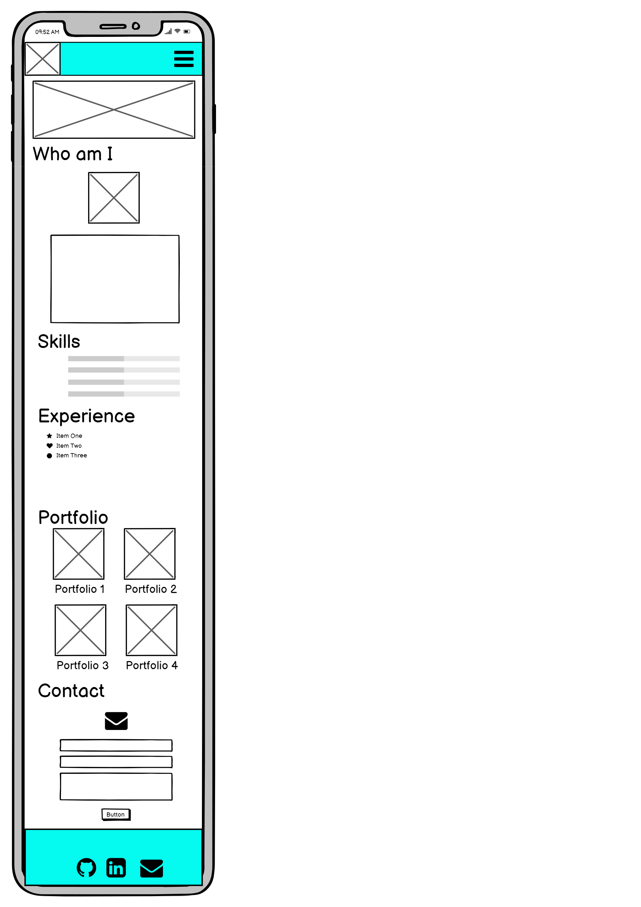
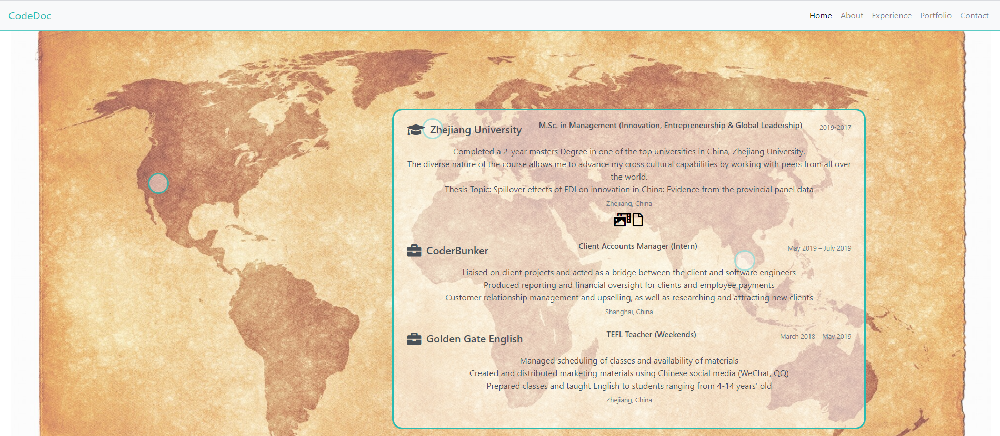
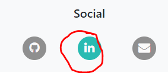
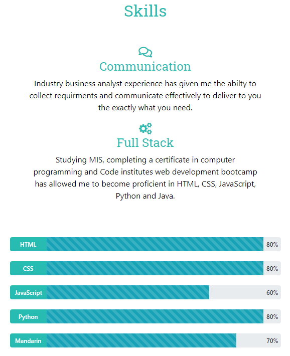
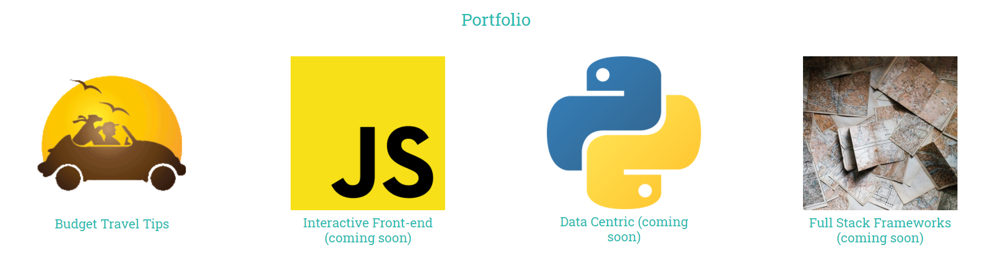
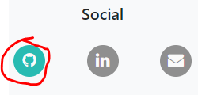
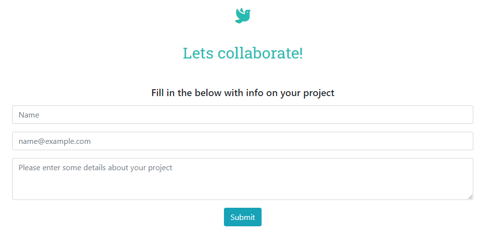
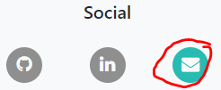

# User Centric Frontend Development Milestone Project 

This project is a portfolio website to showcase my skills and experience to recruiters and potential clients.
This is an interactive website which include designs which can be appreciated by the user.
The website is a vehicle for my brand as a freelance web developer and a means of contact for interested parties.

## UX

The website contains a simple design to ensure the primary function of providing information to the audience on devices of all sizes.
To complement this, an interactive, easy on the eye design has been implemented.
This will be achieved by executing a single paged long scroll website, with options to navigate to any particular section using the menu bar.
Implementing this design will ensure the audience is engaged and to compliment the users stories by firstly feeding the user with “what” it is that the developer does, secondly, showing projects to convey “How” the developer executes and finally, providing a means of contact should they want to collaborate.

In creating my website, I followed the 5 levels of development below and have outlined these in the following headings.
This is an effective means of web development which ensures an appropriate order of approach with each plane becoming less conceptual as the project evolves.
 This process originates from Jesse James Garrett's book, The Elements of User Experience. 

- Strategy Plane
- Scope Plane
- Structure Plane
- Skeleton Plane
- Surface Plane

### Strategy Plane
The strategy plane contains the high-level plan of the website.
This plane is important as it ensures that all the following sections and website end product aligns to the website's objectives.
For this plane, the below primary objectives and user stories of the website were identified below.

#### Project Objectives
- Portray the developers experience and what the website is for.
- Showcase the developer's CSS & HTML skills to the audience.
- Provide the user with a means of contact.

##### User Stories
- As a recruiter/potential client, I want to see the web developers experience, so that I can see if this is relevant to the job/project requirements.
- As a recruiter/potential client, I want to see the web developers’ skills, so that I can see if these skills match the job/project.
- As a recruiter/potential client, I want to see the developer’s portfolio, so that I can see if his previous projects require capabilities relevant to this job/project.
- As a recruiter/potential client, I want to easily find this information while appreciating the websites design, so that I can see that the developer is competent in front-end development.
- As a recruiter/potential client, if interested, I want to contact to the developer, so that I can see if he is available for work.

### Scope Plane
The scope plane is included to identify sections and features for the website.
This is an important section of the process as it ensures the project aligns with the previous mentioned objectives in the Strategy Plane.
It also reduces the risk of "Scope Creep" whereby project features grow in number throughout development.

- Necessary sections which align to the user stories are identifies as below.
  - Home
  - About
  - Experience
  - Portfolio
  - Contact
  
 - The next stage of the process was to brainstorm features to ensure I Showcase my CSS & HTML skills to the user. 
 - In addition to the usual sections a portfolio website contains, I wanted to use an interactive map as a statement piece to showcase CSS skills and provide information on my international experience.
 - The remaining features are mentioned in the surface plane section.

### Structure Plane
The structure plane is the next stage which outlines how the sections and features will fit into the website.
While anticipating the text-heavy nature portfolio websites can be, my objective for this plane was to provide the content to the user in an interactive and easy to digest manner.

#### Design Process 
  - I decided on the interactive map feature for large screens only as using a small screen would be difficult to select specific points on the map.
  - When searching for potential maps on pxhere.com, I came across a treasure island like map which suited the feature aesthetically.
  - Using the lightest and darkest colors from the map, I input this to https://mycolor.space/ to generate a 3 color gradient and that's when I chose a teal-like #5FFBF1 as my primary site color.
  - This color was used as the header font color throughout.
  - Paragraph font was a standard black color throughout. 
  - Other features I decided on were a progress bar for skills, I took inspiration for this from the CodeInstitutes mini-project as it is a great way to visually portray my skills.
  - Font Awesome Icons were used throughout the website to provide more information on sections and links.
 
### Skeleton Plane
Once the sections and features of the website is identified, the skeleton plane can begin.
This plane focuses on the arrangement of the sections and features of the website.

- I created wireframes for both the mobile and browser to visualise the arrangement of my scope.
I began this by using pen and paper with the bootstrap grid system in mind and once a general, responsive idea formed, I created the below using balsamiq.

#### Desktop Wireframe

#### Mobile Wireframe

- The only major changes between the wireframes and the final site version is that I changed the mobile version portfolio section to include 1 entry per column as opposed to 2 in the wireframe.

### Surface Plane
The final plane involves the execution of everything collated and in the previous 4 planes. 
It is important to ensure this plane aligns to the previous 4 planes however when the real website is being designed, different stylistic decisions can be made in an agile manner. For example, I decided on my font in this stage as I could visually identify by trial and error suitable options.

#### Features
Breakdown of the website features currently implemented on the website.

##### Navbar
I created the Navbar using Bootstrap and editing the color to suit my websites design.
The Navbar also compresses to a drop-down menu for the mobile devices.

##### Home
The user is greeted with a simple image which I found on pxhere.com.
I choose this as the yellow glow from the wood matches the teal and the map feature image to appear later.
Additionally, the laptop, phone, books featured in the image convey a design/service use case for the website. 

##### About
The About section consists of "Who am I?" and "Skills" subsections.
The user is greeted with a heading with a circle container and a circle headshop image.
The skills subsection contains multiple progress bars for visual effects.
Other features include font awesome icons.

##### Experience
For desktop, this section includes an interactive map which shows experience depending on location.
When the location is selected, experience relevant to this location appears in an expanded box.
I have included icons with links to media and files to back up my experience.

For mobile, I included the same content, however, to make up for lack of visuals compared to the desktop version, I included the organisations logos. 

##### Portfolio
For the portfolio section, I included a simple bootstrap grid design to show each project in a size-responsive manner.
One of these links are active, the remaining three consists of projects due in the future.

##### Contact
The contact section is designed using a bootstrap form.
This form is not active and when activated, a message prompt is given to the user.
An icon is used to transition into this section with relevant information prompted to contact the web developer.

##### Footer
I included a simple footer design, I used font awesome icons to represent each link. 

#### Future Features
Please see below list of features which I intend to implement at a later stage.
- Media carousel: When an icon is selected in the desktop media section, I plan to implement a media carousel/slideshow for videos/images corresponding to the entry. This is so that the user can enjoy the media without having to leave the website. Currently I have a link to YouTube for each entry.
- Background: I plan to implement subtle background styles for each section to aid the transition. For this version, I stayed with a white background but at a future stage I believe the website can benefit with some variety.
- Responsivity: I plan to improve the general Responsivity of the site once I have a greater JavaScript understanding, this includes the below.
  - Ensuring the Navbar reappears on scroll
  - Allowing progress bars to interactively appear
  - When desktop experience is landed on, map points appear one by one
- Logo: The brand logo is currently represented by a teal CodeDoc in the top left-hand corner. I plan to design a more unique logo using Adobe Illustrator in the future.
- Language: I intend on translating the website to Mandarin Chinese to tailor for the Chinese market. This feature will be an optional change which the user can action using a trigger in the top corner.

## Technologies Used
The main technologies used are as below.

- HTML
  Used to add content to the website
- CSS
  Used to add structure and design to my site
- CodePen
  Used for the map feature, which required a lot of trial and error. CodePen was great to instantly see how my changes effected positioning.
- Bootstrap
  Used throughout the website to easily implement consistent designs, such as the below
  - Navbar: https://getbootstrap.com/docs/4.0/components/navbar/
  - Grid System: https://getbootstrap.com/docs/4.0/layout/grid/
  - Progress bars in skills section: https://getbootstrap.com/docs/4.0/components/progress/
  - Layout of entries in experience section: https://getbootstrap.com/docs/4.0/components/list-group/#custom-content
  - Form in the contact section: https://getbootstrap.com/docs/4.0/components/forms/
- Font Awesome
  - Font Awesome was used to input icons throughout the project. I used 8 different icons throughout the project.
- Balsamiq
  - Used in the design process for wireframes.
- Pxhere
  - Used for images and design inspiration.
- Google Fonts
  - Used for font implementation and inspiration.
- https://mycolor.space/
  - Used for pallet testing.
- GitPod
  - Used to create, commit and push the HTML and CSS changes for the website.
- GitHub
  - Used to deploy the website and store files and code.
- Stackoverflow
  - Used for problem solving to implement desired designs.
  - Used to gain better understanding of how I should approach the implementation of elements.
- W3Schools
  - Used to gather a theoretical knowledge of elements and effects (in particular the button element)
    https://www.w3schools.com/w3css/w3css_buttons.asp
- W3 HTML Validator
  - Used throughout  the project to ensure I was following best practices with HTML code.
- Jigsaw CSS Validator
  - Used throughout  the project to ensure I was following best practices with CSS code.
 
## Testing
### Testing User Stories
#### As a recruiter/potential client, I want to see the web developers experience, so that I can see if this is relevant to the job/project requirements.

- The “Who am I?” section which is a sub section of the “About” section includes a paragraph outlining the developers experience immediately after the welcome image.

- The menu includes an “experience” section where the user can choose to go directly to this information or alternatively scroll down to the “experience” section. On the desktop, the user can select the interactive map which will display experience depending on the location. On mobiles, the user receives a slightly different experience, the developers experience is separated into “Education” and “Employment” and entries are display newest to oldest.

- Media items are also included to route the user to videos or files relating to the developers experience in a new tab.

- The user can also choose to select the LinkedIn icon in the footer section to view the developers' professional experience.

#### As a recruiter/potential client, I want to see the web developers’ skills, so that I can see if these skills match the job/project.

- The menu includes an “About” section where the user can choose to go directly to this information or alternatively scroll down to the “Skills” section which is located within the About section. Below the skills heading shows the developer's 2 most important skills for web development, “Communication” and “Full Stack” with a description of the developers’ skills in these areas.
- Progress bars are then included to visually outline to the user the technical competencies of the developer.

#### As a recruiter/potential client, I want to see the developer’s portfolio, so that I can see if his previous projects required capabilities relevant to this job/project.

- The menu includes a “portfolio” section where the user can choose to go directly to this information or alternatively scroll down to the “portfolio” section. The user can then select the relevant project which will route the user to the desired project in a new tab. (some project is yet to be complete which is displayed by "(coming soon)").

- The user can also choose to select the GitHub icon in the footer section to view the developers work.

#### As a recruiter/potential client, I want to easily find this information while appreciating the websites design, so that I can see that the developer is competent in front-end development.

- The single paged long scroll website creates an easy on the eye continuity, feeding the user with more information. The website renders on all device sizes proving the developer’s competence in responsive web design. The experience map allows for an interactive experience for the user which portrays the users design capabilities in HTML and CSS.
#### As a recruiter/potential client, if interested I want to contact to the developer, so that I can see if he is available for work.

- The menu includes a “contact” section where the user can choose to go directly to this information or alternatively scroll down to the “contact” section. This section is located at the bottom of the page as I feel proving capabilities is the priority before the user feels compelled to contact. 
- The contact section consists of a heading “Lets collaborate” and subheading “Fill in the below with info on your project”, opening the invitation to the user to contact for work.

- The user can also choose to select the Envelope icon in the footer section to email the developer directly.

### Browsers
Tested and working consistently on the below browsers for desktop.
- Google Chrome
- Microsoft Edge 
- Firefox

- Mobile version manually tested throughout using google chrome on Xiaomi 8.

- Tested on below screen sizes using Google Chrome developer tools.
  - Moto G4
  - Galaxy S5
  - Pixel 2
  - Pixel 2 XL
  - iPhone 5/SE
  - iPhone 6/7/8
  - iPhone 6/7/8 Plus
  - iPhone X
  - iPad
  - iPad Pro
  - Surface Duo
  - Galaxy Fold

- The project passed the below validation tests.
  - W3 HTML Validator: https://validator.w3.org/
    
    - <a href="assets/images/user_story_testing/w3validator_html.PNG" target="_blank">HTML Validator success</a>
  - Jigsaw CSS Validator: https://validator.w3.org/
    - <a href="assets/images/user_story_testing/w3validator_css.PNG" target="_blank">CSS Validator success</a>
## Deployment
This project was created using Gitpod for commit and push actions.
This project was deployed using GitHub pages at https://daithioc95.github.io/MS1 as below

### Deploying the project
1. In the Github repository, navigate to the settings tab.
2. Locate the GitHub Pages section.
3. Change source to master and select "Save"
4. To confirm, scroll down to the same section on the refreshed page and the "Your site is published at https://daithioc95.github.io/MS1/" will appear.

### Cloning the project
If you wish to clone this project, action the following instructions.

1. On the respitory "Code" tab, select the "Code" option at the top right.
2. Copy the URL provided in the HTTPS section.
3. Open the GitPod (or favoured environment) terminal and change to the desired directory for the clone to be located. 
4. Enter command "git clone" and paste the previously copied URL.
5. Hit enter and the clone will be created.

## Known Bugs and Fixes
- Progress Bars
  - When rendered to mobile size, the progress bars for 70% and 80% render to an almost identical size. This is a known bug which I plan to correct later on.

## Credits
### Content
All the content was written by me.

### Media
- Home Image: https://pxhere.com/en/photo/33
- Experience map image: https://pxhere.com/en/photo/1450907
- Interactive Front-end image: https://commons.wikimedia.org/wiki/File:JavaScript-logo.png
- Data Centric image: https://commons.wikimedia.org/wiki/File:Python-logo-notext.svg
- Full-Stack Frameworks image: https://www.pexels.com/photo/assorted-map-pieces-2859169/
- CodeInstitute logo: https://www.facebook.com/Code.InstituteIRL/
- Zhejiang University logo: https://en.wikipedia.org/wiki/Zhejiang_University
- University College Dublin logo: https://en.wikipedia.org/wiki/University_College_Dublin

### Acknowledgments
- The experience map was created by adapting and editing code written by Michael Mroz which can be found in the following link (https://codepen.io/mirichan/pen/jEBmyG).
- Inspiration for elements in the about and skills section layout came from the resume section of CodeInstitutes "Mini Project". This include the using the font awesome icons and the progress bars.
- Inspiration to use font awesome icons with hover glow in the footer section was also from the CodeInstitutes "Mini Project".
- Inspiration for the circular headshot image in the about section came from the HTML/CSS Project - love running section of the CSS Fundamentals module.
- Thanks to the Code Institute Tutors for helping me with problem solving.
- Thanks to my mentor, Mark Railton for guidance throughout the project.
- The form submit button message prompt was completed using JavaScript written by Mark Railton. 
- Thanks to the Code Institute Slack channel for providing me with a wealth of information on each aspect of the project.
